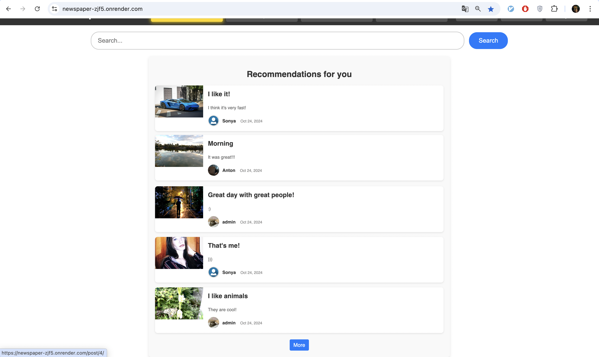
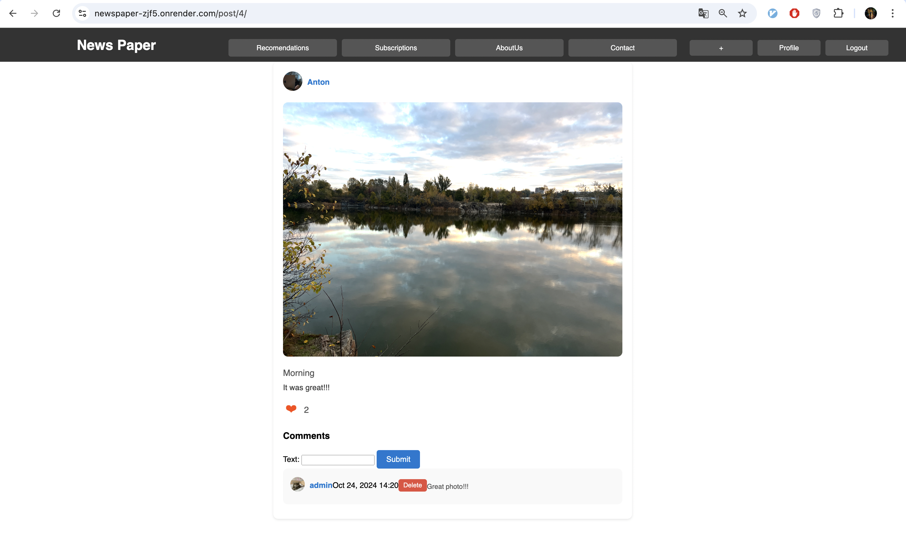
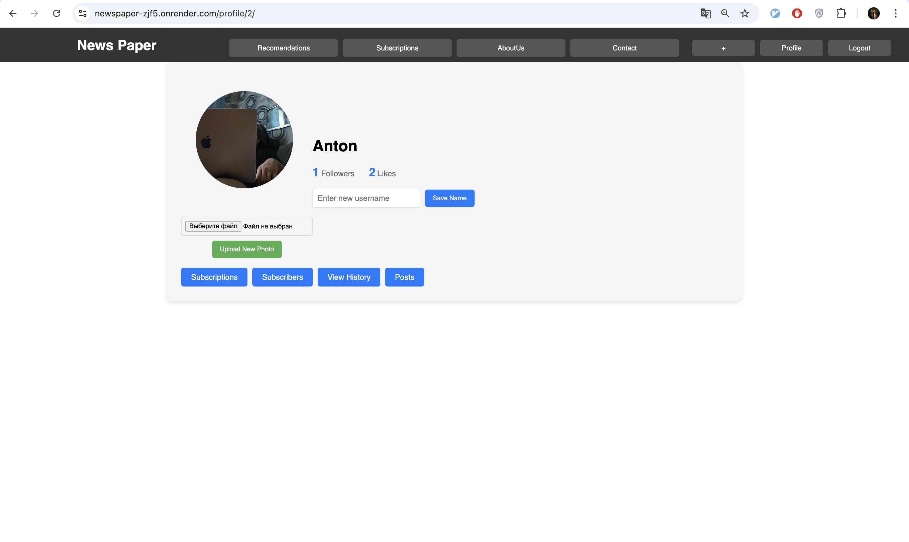

# Django-Social-Network

A simple social network built with Django that allows users to create posts, follow others, and explore content. This project demonstrates my backend development skills using Django, PostgreSQL, and user authentication with custom features.

## Features

- **User Registration & Authentication**: Users can sign up, log in, and log out. The site recognizes if a user is authenticated and adapts pages accordingly.
- **Post Creation**: Users can create posts with text and attach a single image. Posts can be categorized by specific categories.
- **Commenting & Liking**: Users can comment on and like posts to engage with the community.
- **Profile Pages**: Each user has a profile page displaying their posts and user information.
- **Follow System**: Users can follow other users and view posts from accounts they are subscribed to.
- **Personalized Recommendations**: Users receive personalized post recommendations based on their preferences.
- **Profile Customization**: Users can update their profile picture and personal information via the personal cabinet (dashboard).
- **Browsing History**: Users can see their recent browsing history.
- **Pagination**: Post lists are paginated to improve load times and user experience.

## Technologies Used

- **Django**: Backend framework to manage the core functionalities.
- **PostgreSQL**: Database for storing user, post, comment, and like data.
- **Gunicorn**: WSGI HTTP Server for deployment.

## Getting Started

### Prerequisites

To run this project locally, you will need:

- Python 3.8 or higher
- PostgreSQL
- A virtual environment

### Installation

1. Clone the repository:

   git clone https://github.com/yourusername/Django-Social-Network.git

2.	Navigate into the project directory:

    cd Django-Social-Network

3.	Create a virtual environment and activate it:

    python3 -m venv venv
    source venv/bin/activate

4.	Install the required dependencies:

    pip install -r requirements.txt

5.	Set up the PostgreSQL database:
	•	Create a PostgreSQL database and user.
	•	Add your database configuration to the settings.py file under DATABASES.

6.	Run migrations:

    python manage.py migrate

7.	Create a superuser to access the admin panel:

    python manage.py createsuperuser

8.	Run the development server:

    python manage.py runserver

9.	Open your browser and visit:

    http://127.0.0.1:8000/

## Usage

Once the server is running, you can:

	•	Sign up as a new user.
	•	Log in and start creating posts.
	•	Follow other users and see their posts on your feed.
	•	Comment on posts, like them, and explore user profiles.
	•	Customize your profile from the personal dashboard.
	•	View personalized recommendations based on your interests.

### Screenshots
## Screenshots

## Screenshots

| Home Page | Create Post | Post Details | About us | Profile |
|-----------|--------------|--------------|------|-----------|
|  |  |  |  |  |

## Deployment

For deployment, you can use platforms like Render or Heroku. Make sure to configure environment variables such as SECRET_KEY, DEBUG, and DATABASE_URL for production.

### Gunicorn Example:

To deploy with Gunicorn, use the following command:

    gunicorn projectname.wsgi:application --bind 0.0.0.0:8000
