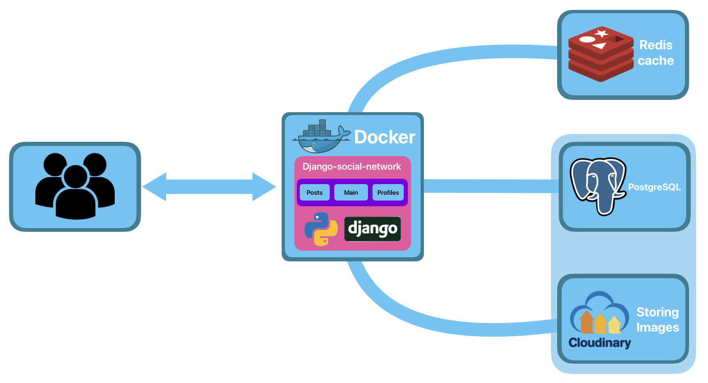
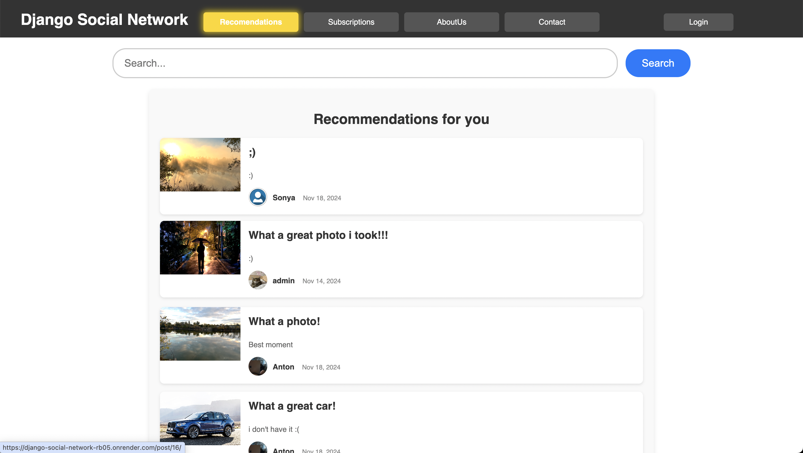
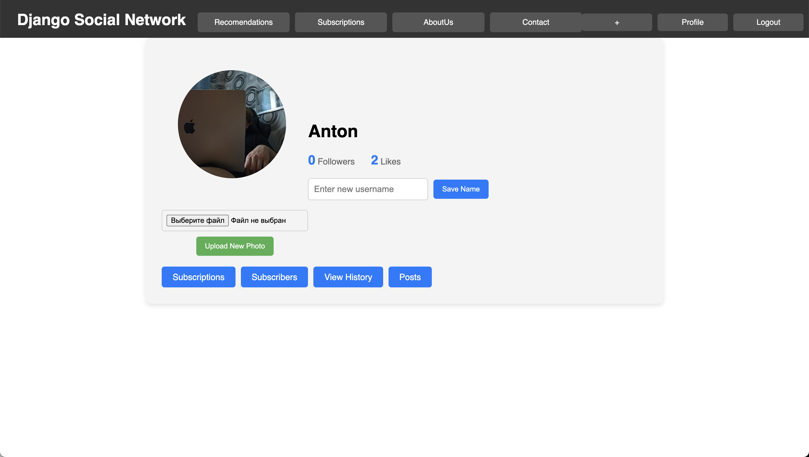
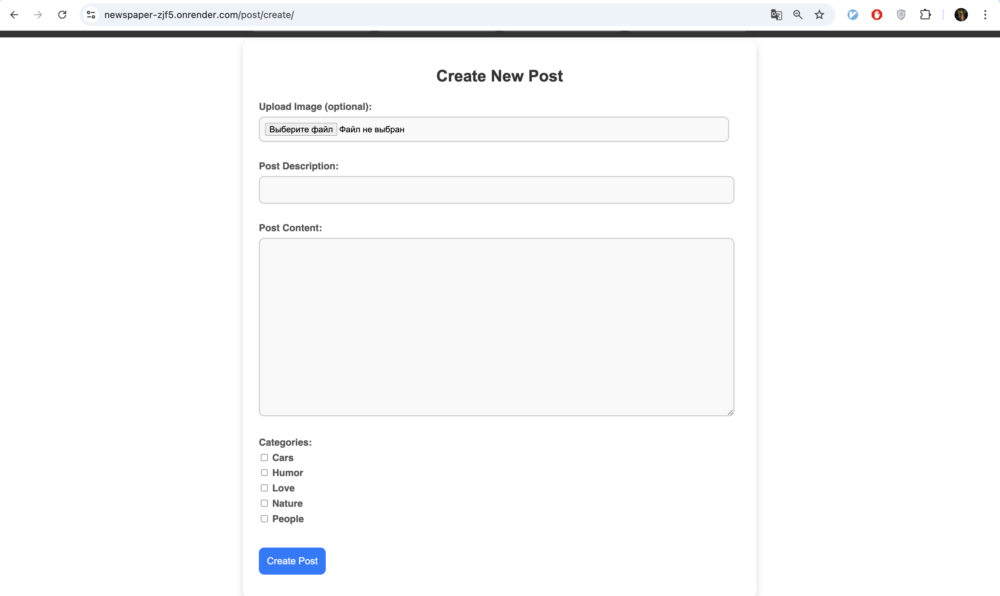

**Django Social Network** - lightweight and feature-rich social network built with Django. It allows users to register, create and publish posts, explore posts from other users, like and comment on posts, follow other users, view detailed user profiles, and enjoy personalized post recommendations based on their activity.

---
## **Scheme of work**

### Scheme Description:
1. **Users** - send requests to the application.
2. **Application** - accepts requests and performs actions.

	**Posts** - responsible for post logic(create, view, delete, comments, likes, categories).
	
	**Main** -  responsible for the recommendation system and search for posts, as well as displaying informative pages.
	
	**Profiles** - responsible for the logic of user profiles (registration, login, logout, profile view, subscriptions).
	
3. **Redis** - data caching to reduce load.
4. **PostgeSQL** - storage of all data (users, posts), as well as links to photos in cloudinary.
5. **Cloudinary** - storing all images.

---
## **Interface screenshots:**
### **Home page**


---
### **User Profile**


----
### **Creating a post**

---

## **Technology:**
- **Backend**: Django  
- **Database**: PostgreSQL  
- **Caching**: Redis  
- **Image Storage**: Cloudinary  
- **Deployment**: Render, Docker  
- **API integrations**: Cloudinary

---
### **Local Installation**
1. Clone the repository:
```bash
git clone https://github.com/AntonBliznuk/Django-Social-Network
```

2. Install dependencies:
```bash
pip install -r requirements.txt
```

3. Perform database migrations:
```bash
python3 manage.py migrate
```

4. Start the local development server:
```bash
python manage.py runserver
```

6. Open the application in your browser: [http://127.0.0.1:8000](http://127.0.0.1:8000).


### **Contacts**
If you have any questions or suggestions, email me:

📧 **Email**: bliznukantonmain@gmail.com
